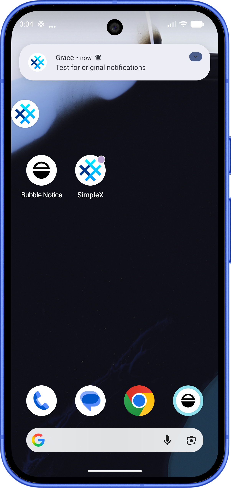
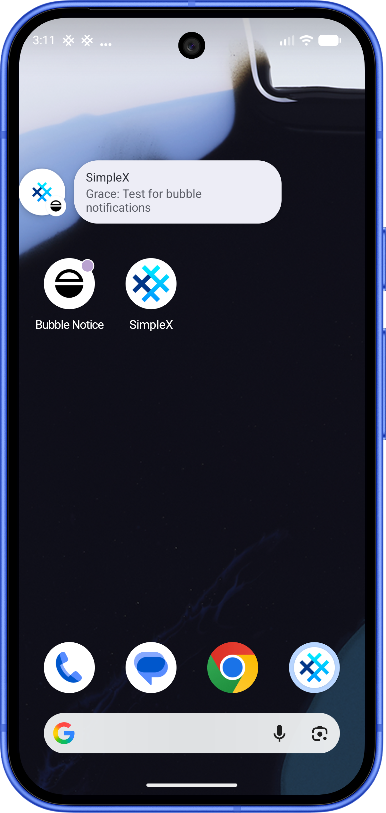
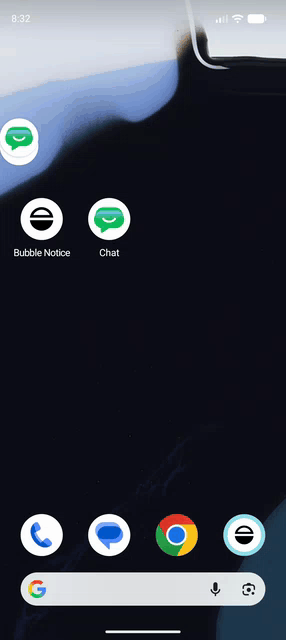
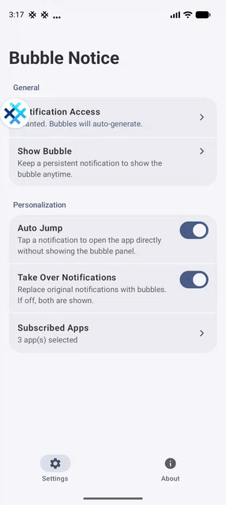
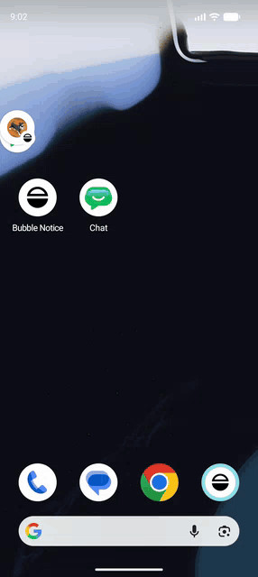

# Bubble Notice

  

   
  
  

  
  
  
  
  

[English](https://github.com/GraceThings/bubble-notice-android/blob/master/README.md)

## 关于

一个轻量级的气泡通知工具, 为 Android 17 中的多任务 "气泡" 功能提供更符合直觉的通知, 且同样适用于支持 "气泡" 的更低安卓版本 (Android 11+), 无需 "Root/Shizuku" 权限.

## 演示

### 截图对比

| 原生通知 | 启用气泡通知 |
|---|---|
|  |  |

### 动图对比与功能演示

| 原生通知 | 启用气泡通知 | 未读通知 | 自动跳转 |
|---|---|---|---|
|  |  |  |  |

## 功能

- **关注核心**: 自由订阅你常用的应用
- **气泡化通知**: 为新通知生成系统级常驻消息气泡, 不错过任何重要信息
- **智能堆叠与展开**: 智能合并同应用的连续通知; 默认精简显示, 点击即可展开查看完整长文本和原生快捷操作
- **无缝快捷处理**: 完美继承并提取原生通知的快捷操作(如标记已读, 内联回复), 直接在气泡面板内快速处理
- **一键直达聊天**: 点击气泡面板的卡片外部区域, 瞬间自动跳转至应用内对应的聊天界面
- **集中控制台**: 在统一的气泡控制台中高效管理所有未读消息
- **防打扰体验**: 随时移除气泡以保持专注

## 从 Google Play 安装

帮助我完成 Google Play 的内部测试, 非常感谢! :)

1. 先加入 [测试群组](https://groups.google.com/g/gracethings-testing-group)
2. 然后在网页端 [加入测试](https://play.google.com/apps/testing/io.github.gracethings.bubblenotice)
3. 最后前往商店 [下载安装](https://play.google.com/store/apps/details?id=io.github.gracethings.bubblenotice)

## 如何使用

1. 允许读取 "通知使用权"
2. 订阅常用的应用
3. 启用并显示主控台气泡

> 设置好 BubbleNotice 后, 当有新通知到达时, 点击气泡弹出的通知或控制台内的未读消息卡片, 即可一键直达应用内对应的聊天界面!

## Bug 反馈

提交一个 [issue](https://github.com/GraceThings/bubble-notice-android/issues).

## 开源协议

参阅 [License](https://github.com/GraceThings/bubble-notice-android/blob/master/LICENSE.txt).
